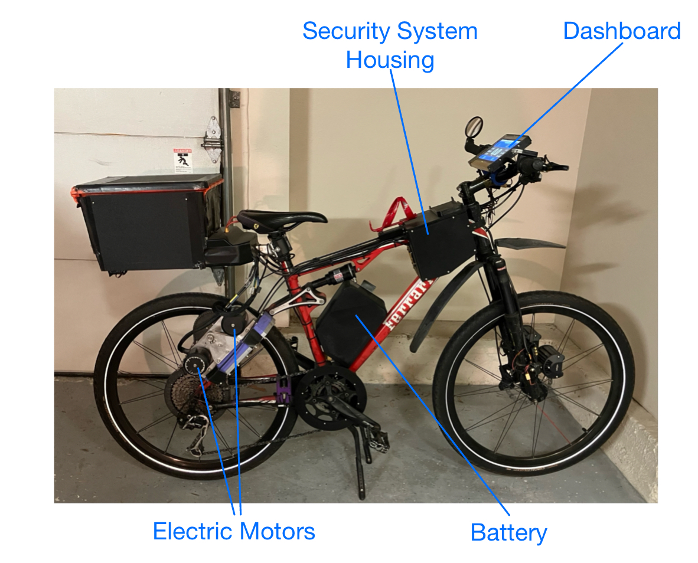
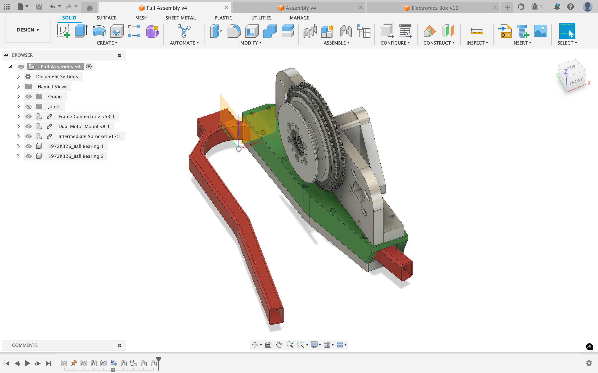
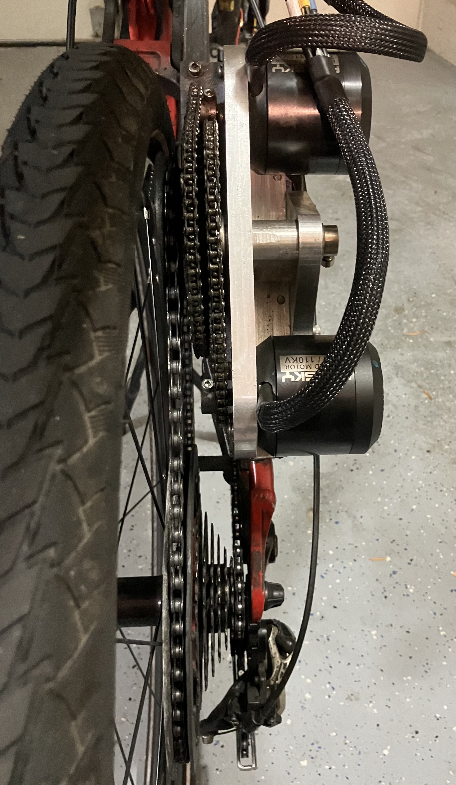
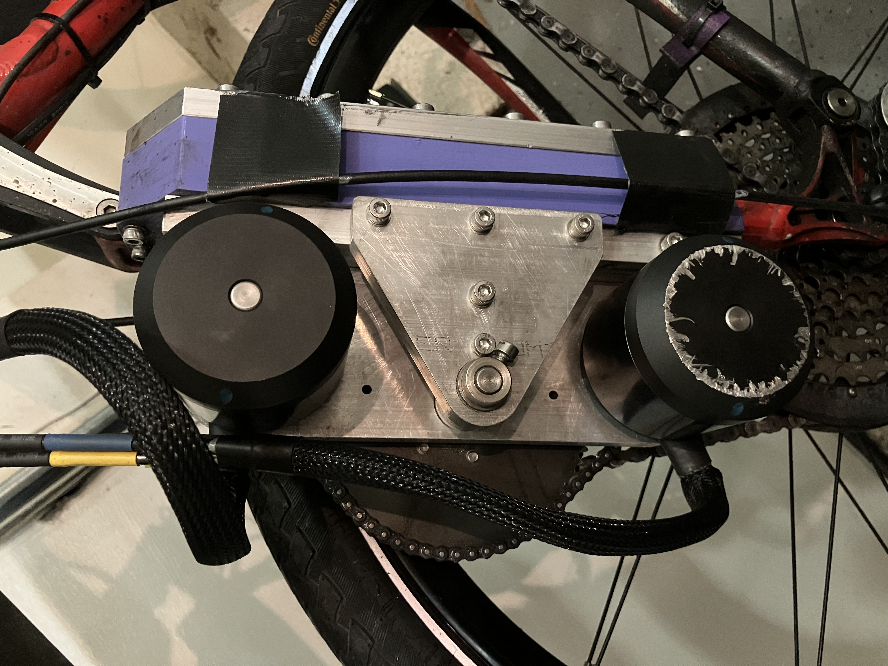
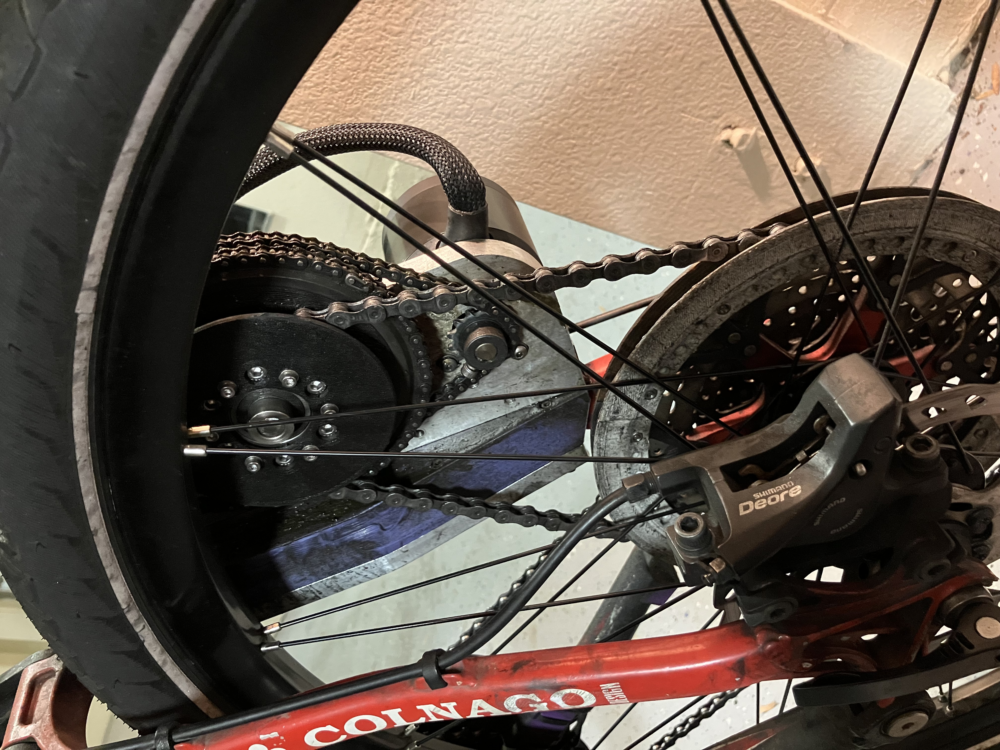
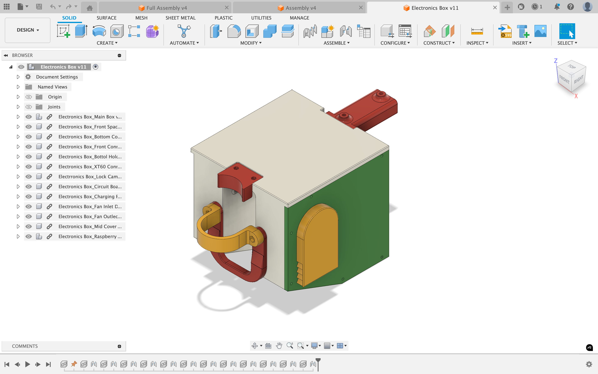
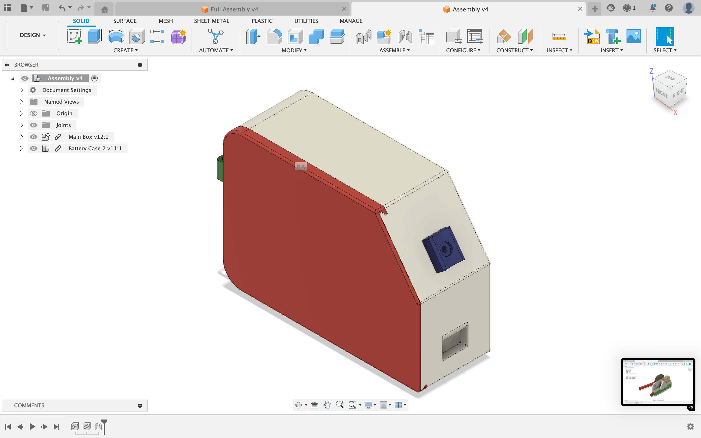

# E-Bike Project Description
 This e-bike project was started many years ago. Starting with converting this bicycle to an e-bike, I have made many changes to the powertrain and other systems throughout the years. This depository includs CAD files for the electric powertrain and python codes for the security system.                    
 

# Features
- 35 mph top speed
- Accelerates from 0 to 30mph in 3.2 seconds. (Measured with the same GPS module, my car did 0-30 in 3.7 seconds) 
- Dual electric motors with peak power output of 6000W.
- Custom made 48V, 12Ah lithium-ion battery pack. 
- 15 miles of range at top speed. Range can be extended to around 40 miles with additional battery packs.
- Smart anti-theft system with vibration detection, GPS tracking, camera pointing at the lock, and email notifications.

# Electric Powertrain
- All CAD models were made in Fusion 360              
  

- FEA simulations using Ansys and Fusion 360 to assist with the design of the motor mount
  

- Plastic parts were 3D printed in PLA and Nylon; aluminum parte were machined on my CNC machine
  
  
- Custom made lithium-ion battery pack by spot welding together 42 21700 cells in a 14S3P configuration.
  

- More pictures of the electric powertrain below.                   
  
                                                   
  

  

# Security System
- System is based on a raspeberry pi computer with multiple sensors connected such as GPS module, IMU, ADC. All the programs that makes this system work are written in python. This system was made for theft prevension purposes.
  
- In lock mode, system automatically sends emails containing gps coordinates and picture when suspicious activities such as vibration or significant changes in GPS coordinates are detected.                  
  

- Remote control of things such as lights and viewing live camera feed through VNC remote desktop.
  

- 7" touchscreen showing a custon GUI serves as dashboard of the e-bike.
  

- 3D printed custom housing for electrical components           
  
  
  

